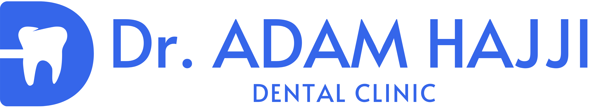

# Dr. ADAM HAJJI Dental Clinic Website

A premium, modern, and fully responsive dental clinic website built with the latest web technologies. This project showcases the services, team, and expertise of Dr. ADAM HAJJI Dental Clinic located in El Jadida.



## ✨ Features

- **Modern UI/UX**: Stunning design with a focus on professional aesthetics and user experience.
- **Responsive Design**: Fully optimized for all devices (mobile, tablet, desktop).
- **Internationalization (i18n)**: Built-in support for multiple languages (French and English).
- **Smooth Scrolling**: Enhanced browsing experience using [Lenis](https://github.com/darkroomengineering/lenis).
- **Interactive Sections**:
  - **Hero**: Engaging entry point with clear call-to-action.
  - **Services**: Detailed overview of dental treatments and expertise.
  - **About**: Insight into the clinic's mission and philosophy.
  - **Team**: Meet the professional staff.
  - **Gallery**: Visual showcase of the clinic's facilities and results.
  - **Testimonials**: Social proof from satisfied patients.
  - **Pricing**: Transparent treatment pricing cards.
  - **FAQ**: Answers to common patient questions.
  - **Contact**: Easy-to-use contact form and location details.
- **Performance Optimized**: Built with Next.js 16 and React 19 for blazing-fast performance.
- **Premium Animations**: Fluid transitions and micro-interactions powered by [Framer Motion](https://www.framer.com/motion/).

## 🚀 Tech Stack

- **Framework**: [Next.js 16](https://nextjs.org/) (App Router)
- **Library**: [React 19](https://react.dev/)
- **Styling**: [Tailwind CSS 4](https://tailwindcss.com/)
- **Animations**: [Framer Motion](https://www.framer.com/motion/)
- **Carousel**: [Embla Carousel](https://www.embla-carousel.com/)
- **Icons**: [Lucide React](https://lucide.dev/)
- **Fonts**: [Google Fonts (Alata)](https://fonts.google.com/specimen/Alata)
- **Smooth Scroll**: [Lenis](https://lenis.darkroom.engineering/)

## 📂 Project Structure

```text
src/
├── app/              # Next.js App Router (pages and layouts)
├── components/       # React components
│   ├── layout/       # Global components (Navbar, Footer, SmoothScrolling)
│   ├── sections/     # Landing page sections (Hero, Services, etc.)
│   └── ui/           # Reusable UI primitives (Buttons, Cards, etc.)
├── i18n/             # Translation logic and language context
├── lib/              # Utility functions and shared logic
└── public/           # Static assets (images, logos, etc.)
```

## 🛠️ Getting Started

### Prerequisites

- Node.js 18+ 
- npm / yarn / pnpm

### Installation

1. **Clone the repository**:
   ```bash
   git clone https://github.com/KamalAassab/dr-adam-hajji.git
   ```

2. **Install dependencies**:
   ```bash
   npm install
   ```

3. **Run the development server**:
   ```bash
   npm run dev
   ```

4. **Open the project**:
   Navigate to [http://localhost:3000](http://localhost:3000) in your browser.

## 📦 Build & Deployment

To create a production build:
```bash
npm run build
```

To start the production server:
```bash
npm start
```

## 📄 License

This project is private and intended for Dr. ADAM HAJJI Dental Clinic.

---
Developed with ❤️ by the Antigravity AI.
